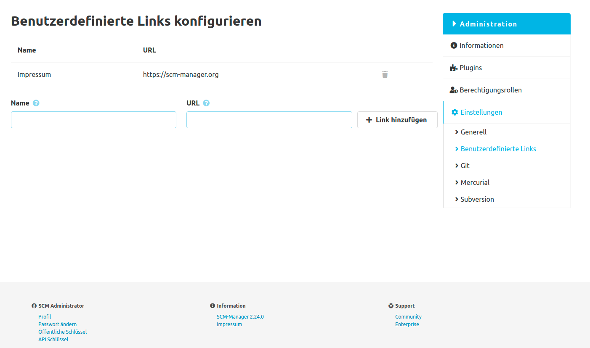

Mit diesem Plugin können Sie eigene Links in die Fußzeile des SCM-Managers einfügen, damit alle Benutzer sie sehen können.
Die Konfigurationsseite finden Sie im Bereich Administration. Dort können Sie Ihre Links über ein einfaches Formular erstellen, aktualisieren oder löschen.
Sobald Sie einen Link erstellt haben, wird dieser sofort in der Fußzeile des SCM-Managers im Bereich "Informationen" angezeigt.
Denken Sie daran, dass die URL Ihres Links mit einem Protokoll wie `http://` oder `https://` beginnen muss.
Wenn Sie kein Protokoll angeben, wird ein relativer Link von Ihrer SCM-Manager-Instanz erstellt.

