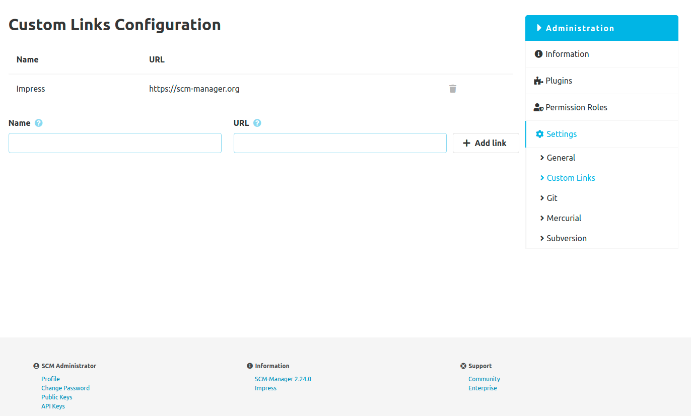

Custom links can be created, updated and deleted using a simple form.
Once a link is created, it will be displayed in the footer in the "Information" section.
The link URL must start with the protocol such as `http://` or `https://`,
otherwise a relative link will be created starting from this instance.

